# 영화 데이터 기반 영화 추천 사이트

---


## 🥇 **PJT 목표**

```markdown
- 영화 데이터 기반 추천 서비스 구성
	- 영화 장르 기반 추천 서비스 구성
	- 코사인 유사도를 통한 추천 서비스 구성
	- 코사인 유사도를 통한 영화 제목 검색 서비스 구성
- 커뮤니티 서비스 구성
- HTML, CSS, JavaScript, Vue.js, Django, REST API, DataBase 등을 활용한 서비스 설계
- 서비스 관리 몇 유지보수
```


## 😎 팀원 정보 및 업무 분담 내역

**강민재 ( Back-End )**

```markdown
- 프로젝트 방향 구성 및 ERD 설계
- DRF 서버, Model-URL-View 설계
- 추천 알고리즘 구현
- Profile 화면 구현
- DataBase Seeding
- Back-End 최종 리팩토링
```


**장창완 ( Front-End )**

```markdown
- 프로젝트 방향 구상 및 ERD 설계
- 피그마 UI, UX 디자인
- Vuex store & router 설계
- Component 설계
- Main, Nav, Community, Account 화면 구현
- front-End 최종 디자인 & 리팩토링 
```


**이태엽 ( Front-End )**

```markdown
- 프로젝트 방향 구상
- 피그마 UI, UX 디자인
- MovieList & MovieDetail 화면 구현
- Movie 좋아요 기능 구현
- front-End 최종 디자인 & 리팩토링
```


## 💻 목표 서비스 구현 및 실제 구현 정도 

## ( 아래에 해당하는 내용에 사진 및  내용추가)

- 페이지 간 뷰라우터를 이용하여 자유롭게 이동 가능


- Vuex store , Component , Vue View를 movie, account, community로 나누어 목적에 맞게 원하는 정보를 가져다 쓸
  수 있게 설계 및 유지보수


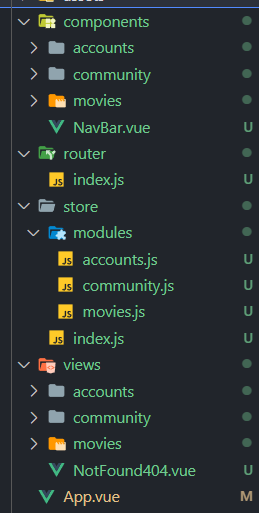


- 로그인 시 2개의 추천 알고리즘을 통해 좋아할 수 있는 영화를 추천하는 메인 페이지 구현


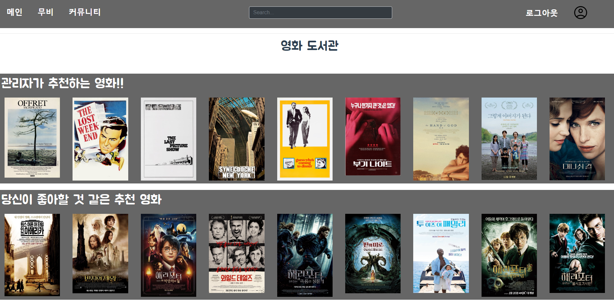


- 영화 제목을 이용하여 검색 기능 구현


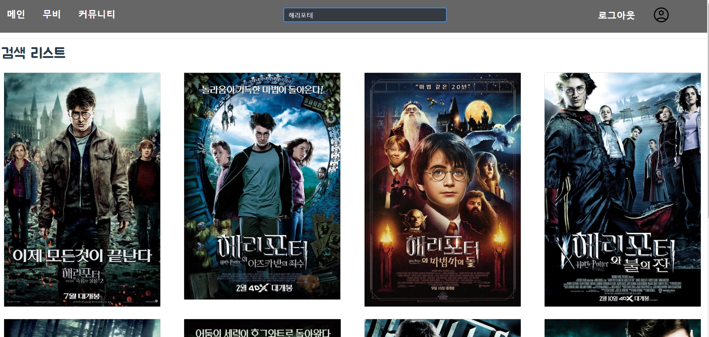


- 프로필 화면에서 자신이 좋아요누른 영화와 자신이 쓴 글을 볼 수 있게 구현


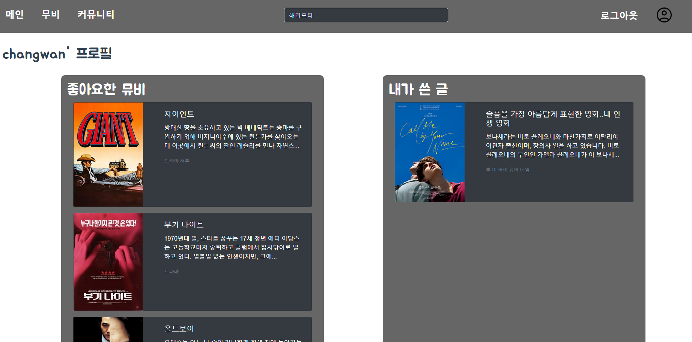


- Router에 없는 url의 경우 404 url로 보낼수 있게 구현


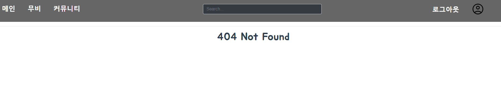


- 리뷰 작성시 평점을 별점으로 구현

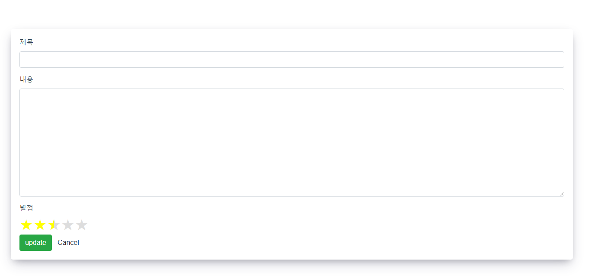


## 📑 데이터베이스 모델링 (ERD)

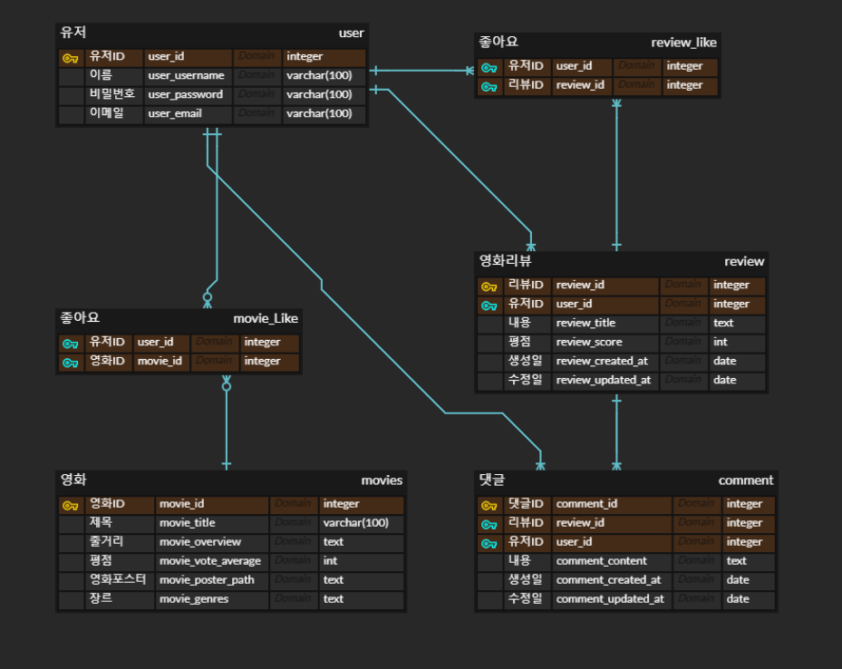


## 🚧 필수 기능에 대한 설명 ( 아래에 해당하는 내용에 사진 및 내용 추가)


- **관리자 뷰**

  - 관리자 권한의 유저만 영화 등록 / 수정 / 삭제 권한을 가집니다. 

  - 관리자 권한의 유저만 유저 관리 권한을 가집니다. 

    

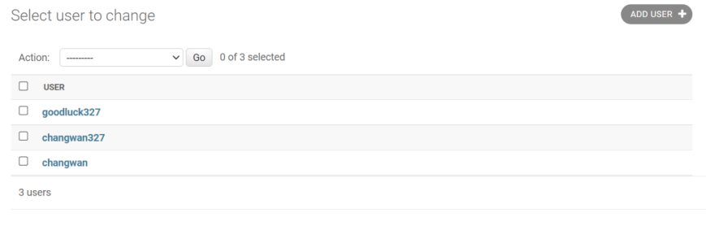


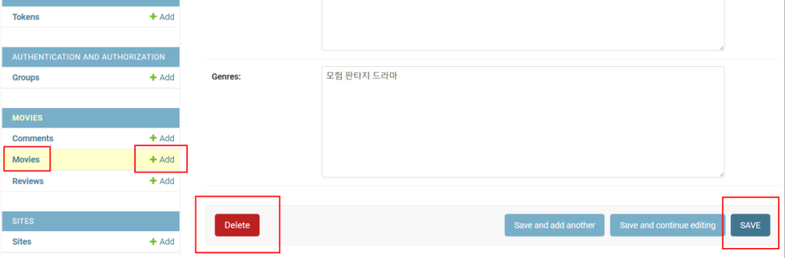


- **영화 정보**
  - 영화 데이터는 Database Seeding을 활용하여 최소 50개 이상의 데이터가 존재하도록 구성해야 합니다
  - 로그인 된 유저는 영화에 대한 평점 등록 / 수정 / 삭제 등을 할 수 있어야 합니다.


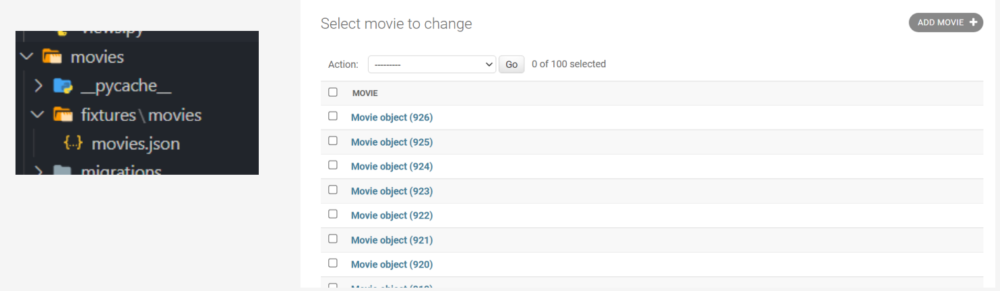


- **영화 추천 알고리즘**
  - 유저가 좋아요를 누른 영화를 토대로 추천해주는 추천 알고리즘
  - 제목과 장르를 기반으로 코사인 유사도를 계산하여 유사도가 높은 18개 영화를 추출
  - 18개중 랜덤으로 9개를 추첨하여 화면에 구현

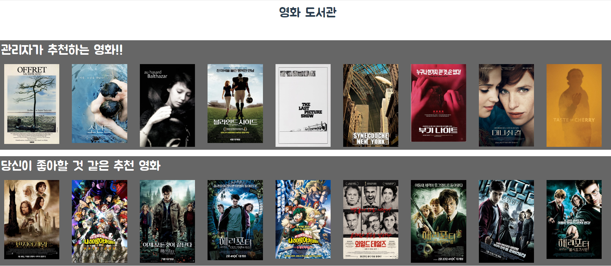


- **커뮤니티**
  - 영화 정보와 관련된 소통을 할 수 있는 커뮤니티 기능을 구현해야 합니다.
  - 로그인 사용자만 글을 조회 / 생성 할 수 있으며, 작성자 본인만 글을 수정 / 삭제 할 수 있습니다.
  - 사용자는 작성된 게시 글에 댓글을 작성할 수 있어야 하며 작성자 본인만 댓글을 삭제할 수 있습니다.
  - 각 게시글 및 댓글은 생성 및 수정 시각 정보가 포함되어야 합니다.

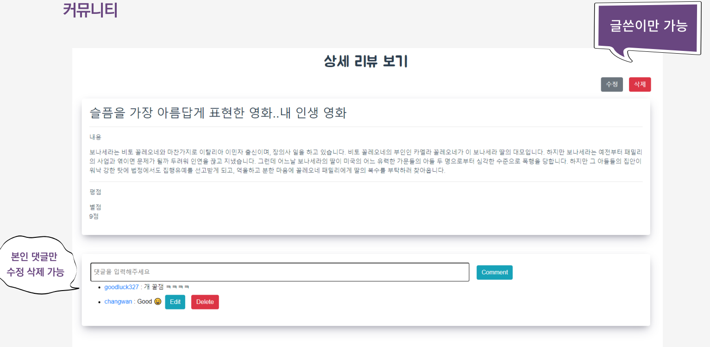


- **기타**

  - 최소한 5개 이상의 URL 및 페이지를 구성해야 합니다.
  - HTTP Method와 HTTP response status codes는 상황에 맞게 적절하게 반환되어야 하며, 필요에 따라 메시지 프레임워크 등을 사용하여 에러 페이지를 구성해야 합니다.

  

  

## 🎁 느낀점


- 강민재

```markdown
마지막 관통 프로젝트는 파트를 나눈 가운데 완전한 협업으로 진행되었다. 
내가 맡은 백엔드 부분은 이미 익숙한 장고 였기 때문에 막힘없이 진행되었다. 
그리고 처음 구현해보는 추천 알고리즘은 따로 공부를 진행한 뒤 하루정도 시간을 들여 완성했다. 
프론트 엔드 부분은 워낙 컴포넌트가 많기 때문에 개발 후반부에는 모두가 힘을 모아서 완성했다. 하지만 여러 사람이 프론트 엔드 작업을 하자 깃이 꼬이는 문제가 생길 수 있어 주의가 필요했다. 
팀에 잘 못 따라오는 팀원이 있어 개발 일정이 많이 지연되었지만, 다른 팀원들과 힘을 합쳐 개발 일정을 맞출 수 있었다. 많이 배웠다.
```


- 장창완

```
지금까지 배운 모든 것을 활용하여 프로젝트를 만들어야 했는데 초기에 배운 내용 HTML, CSS 부분이 잘 기억이 나지않아 이전 공부했던 자료를 다시보면서 공부했어야 했다.
Vue를 사용하여 프론트를 구현 하였는데, 짧은 시간동안 많은것을 배워서 실제로 프로젝트를 만들면서 Vue 에 대해서 많은 것을 배운것 같습니다.
Django(Back-End)와 연결하여 데이터를 받아오는 것이 어려울것이라고 생각했는데 실제로는 데이터 받는 것은 생각보다는 쉬웠지만 라우터끼리 데이터 전달이 오히려 더 어려웠던거 같았습니다.
정해진 시간내에 구현해야되는 것이다보니 프론트 쪽을 조금 더 동적으로 꾸미지 못해서 아쉬웠습니다.
```


- 이태엽

```markdown

```


