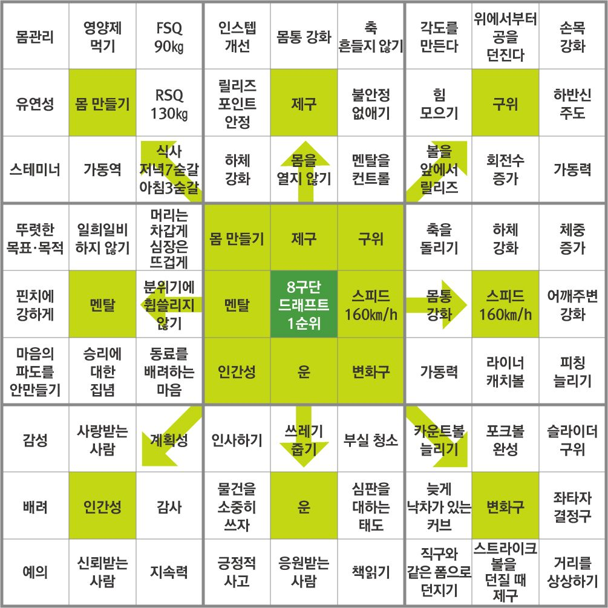

취업준비를 하다보면 신경써야 하는 것이 한두개가 아니다. 코딩테스트 준비, CS공부, 영어공부, 자격증 등등. 각각의 준비를 체계적으로 하지 않으면 막상 지원서를 작성할 때, 준비하지 못한 것이 생겨 문제가 생길 수 있다. 지금 현재 나에게 필요한 준비는 무엇인지 정확히 파악하기 위해 만다라트를 만들어보려고 한다.

개발자 취업준비를 하다보면 신경써야 하는 것이 한두개가 아니다. 코딩테스트 준비, CS공부, 영어공부, 자격증 등등. 각각의 준비를 체계적으로 하지 않으면 막상 지원서를 작성할 때, 준비하지 못한 것이 생겨 문제가 생길 수 있다. 지금 현재 나에게 필요한 준비는 무엇인지 정확히 파악하기 위해 만다라트를 만들어보려고 한다.

---

### 1. 만다라트란 무엇인가.

> 만다라트는 일본의 디자이너 이마이즈미 히로아키가 개발한 발상기법이다.
>
> 연꽃 모양으로 아이디어를 발상해 나가는 기법으로 분교의 만다라 형태와 유사하다고 하여 만다라트라고 불린다.

만다라트를 만들 때는 우선 9 * 9 테이블을 만든다. 마치 스도쿠처럼 생긴 테이블의 가운데에 발상의 주제를 적는다. 그 주제의 주변 여덟군데에 주제와 관련된 세부 주제를 적는다. 이제 9 * 9 테이블을 다시 9개의 3 * 3 테이블로 나누고, 각각의 세부 주제와 관련된 세부 내용을 적어 넣는다.

만다라트는 오타니 쇼헤이로 인해 유명해졌다. 그는 자신의 목표인 8구단 드래프트 1순위를 이루기 위해서 만다라트를 작성했다.

처음에는 막연했던 8구단 드래프트 1위라는 목표가 만다라트를 작성하는 과정에서 구체적인 목표로 변했다.

---

### 2. 만다라트 작성하기

이번에는 실제로 취업준비와 관련해서 만다라트를 작성해보자.

만다라트 양식을 직접 작성해도 좋지만, 지금은 neojay님이 블로그에 공개한 엑셀 양식을 사용하겠다. [출처: https://neojay.tistory.com/503]

